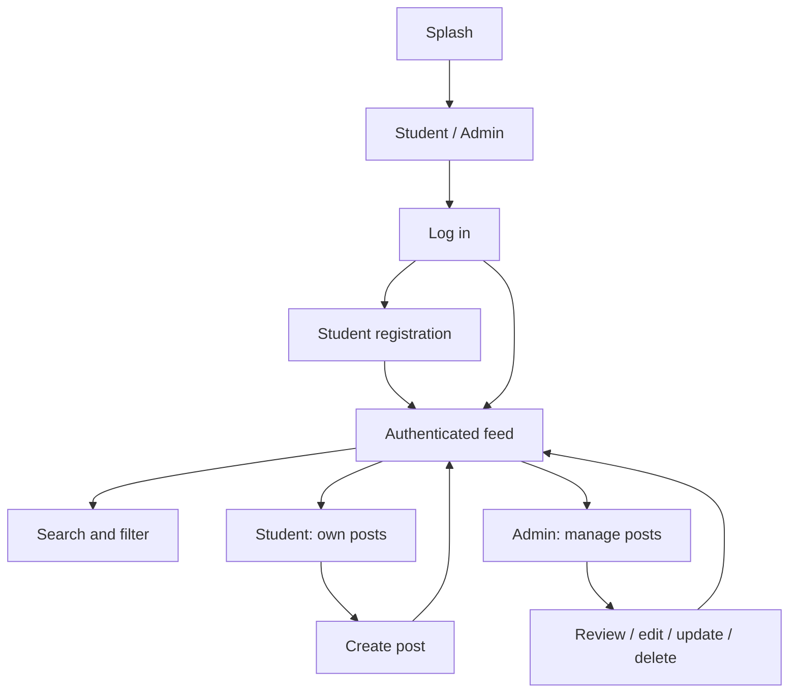
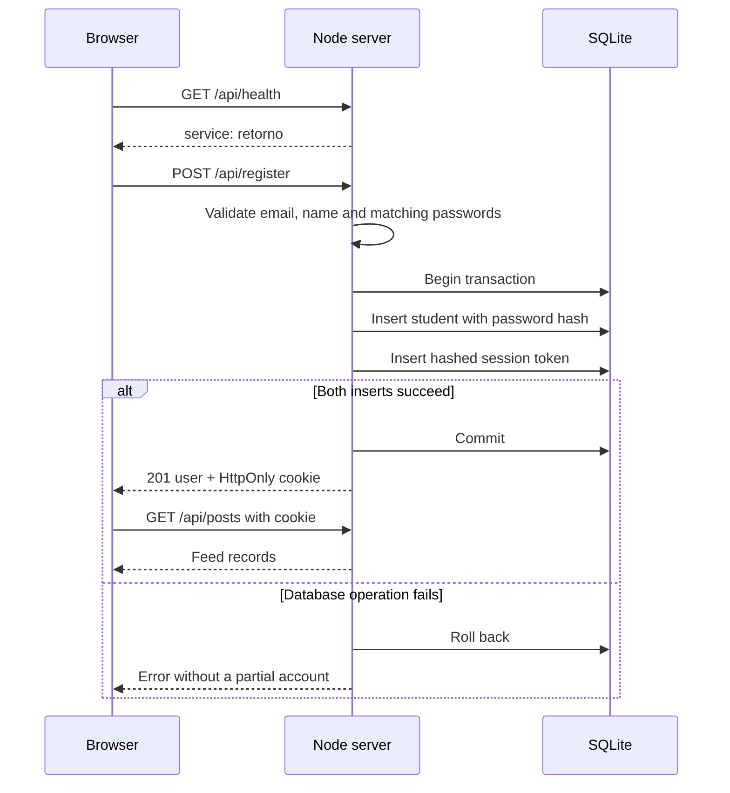
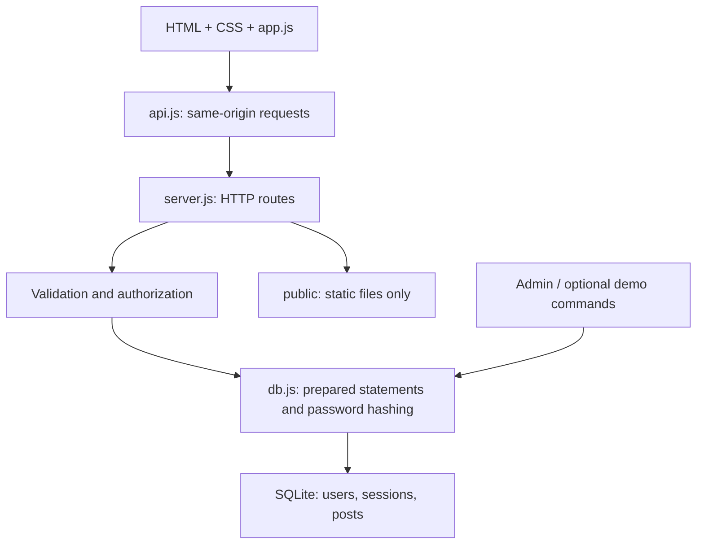
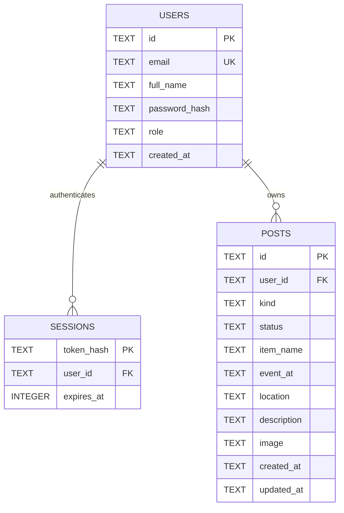

# RETURNO: verified requirements, workflow, architecture, and schema

Version 1.3.0. Scope: the provided Lost & Found designs plus the requested removal of Organization, account-flow correction, responsive layouts, admin-only post management, and direct student return to the homepage. No messaging, notifications, additional campuses, or extra dashboards.

## 1. Requirements and verification

| Requirement | Implemented behavior | Verification / evidence |
| --- | --- | --- |
| Remove Organization | Splash continues directly to Student / Admin. No Organization markup or styles remain. Old unknown routes fall back to role selection. | Source review of `public/app.js` and `public/styles.css`. |
| Student registration | Email, full name, password and confirmation; creates a student and signs them in. | API test: creation, authenticated feed, logout, fresh login and user lookup. |
| Fix account-fetch failure | One Node process serves UI and API. Startup verifies `/api/health`; wrong server, network failure and invalid responses are handled explicitly. Windows launcher starts the backend and opens its URL. | Client tests exercise wrong-server HTML, network failure and JSON error messages. The user's original machine error was not reproduced. |
| No partial signup | Account and session inserts commit together or both roll back. | Test forces session insertion failure and verifies no orphan account remains. |
| Student / Admin roles | Login checks selected role; admin login has no public registration link. Initial admin uses setup; authenticated admins can register additional admins. Student registration cannot elevate privileges. | Role-spoofing, wrong-role login and admin API tests. |
| Persistent accounts / posts | SQLite on local disk, with parameterized queries. | Separate SQLite connection reads saved records; login after logout works. |
| Search and suggestions | Search every post by item name, description, location, date, type, status, or poster. Show category suggestions while empty; hide them for a query and restore immediately when cleared. | Search UI state checks and source checks cover every query field. |
| Student portal | Students can create and view details; their profile lists their posts. Administrators cannot create student posts. Students cannot use admin review or management actions. | Role and ownership authorization tests. |
| Create / manage | Students can create posts. Only admins can review individual records, edit, update status, or delete. Students have no management menu. | API tests reject owner and non-owner student management requests; UI tests confirm absence of controls. |
| Registered users | Admins can view registered users' names, email addresses, and roles. Password hashes and other private account fields are excluded; students cannot access the endpoint. | In-process API test verifies admin access, student denial, and response fields. |
| Image uploads | PNG/JPEG/WebP, up to 2 MB; signature and size validation. Stored with post. | Valid image and rejected format/signature tests. |
| Equal post cards | Student/feed post cards share a fixed responsive grid row. Admin list rows share a fixed height. Preview detail lines clip with ellipses; clicking a card opens full detail. | UI tests check fixed card/list heights, overflow style, and click/keyboard detail view. |
| Admin management | Live status totals, post list, details, editing, status update, deletion. | Counts and administrator operation tests. |
| Responsive design | Document-flow auth forms, bounded readable font sizes, wrapping content, fluid images. Post columns fill the available viewport width and wrap without enlarging controls. Search categories reflow from three to two. Stats wrap to fit, with two columns on phones. | CSS/source review. Browser/device verification remains pending. |
| Schema integrity | Foreign keys enabled, role/type/status checks, unique email and primary keys. | SQLite integrity check, foreign-key check and rejected constraint violations. |

**Acceptance boundary:** automated checks verify the API, data and client request handling. They do not prove pixel-identical rendering or behavior on every browser/device. The exact font is still unavailable; source logo/category images are retained.

## 2. User workflow

Report `event_at` values are Philippine campus wall time (PHT, UTC+08:00, Asia/Manila), stored as `YYYY-MM-DDTHH:mm`. Explicit Gregorian calendar checks reject impossible dates, invalid leap days, and out-of-range hours/minutes. Years 0001 through 9999 are supported. API inputs containing seconds or timezone suffixes are rejected. Server/device timezone settings do not convert report values. Existing records are not rewritten; SQLite `created_at`/`updated_at` remain UTC database timestamps and are separate from report event time.

- Registration is always for students. It does not create administrators even when reached after choosing Admin.
- Clicking the signed-in logo opens the feed. The profile icon opens Your post for students or management for administrators. The magnifier opens search. The profile icon opens the student profile or admin dashboard. Normal navigation adds screens to browser history, so Back returns to the prior screen. Home and Profile controls offer direct shortcuts.
- A student opens +, selects Lost / Found, fills details, optionally uploads an image, then submits. Cancel exits the form without submitting and replaces the editor entry with the feed. Successful save returns directly to the homepage with the All filter. The editor history entry is replaced so Back cannot reopen a cancelled or submitted form. The editor has direct Home and Profile buttons. Ordinary in-app routes stack for browser Back. Choosing Home or Profile jumps directly to that destination.
- Admin-only Edit reuses the existing form. Update changes status. Delete requires confirmation. Students cannot invoke these operations on their own posts or others’ posts, including direct API requests.
- Administrators may edit/update/delete any post. Counts refresh from the same posts table used by the feed.
- The admin dashboard includes a Registered users list showing each account's name, email, and role. The users endpoint requires an admin session and returns no password hashes.
- Student and admin page headers provide Log out. Successful logout revokes the current session, clears private client state and the remembered role, and returns to role selection. An already-expired session also exits cleanly; network failures show an error and allow retry. Sessions otherwise expire in seven days.

## 3. Account request flow and failure handling

The prior supplied API already passed registration tests. A fetch error can instead occur if the backend is stopped, Node cannot start, the page is opened as a file, or VS Code Live Server serves the frontend without an API. The original client assumed every response was JSON and did not clearly distinguish these conditions. Version 1.1 checks backend readiness before showing forms and provides specific connection/setup errors.

There is no cross-origin fallback sending passwords to another host and no automatic retry of registration. If a network timeout occurs after a commit, the client advises trying login first. HTTP cannot guarantee the browser received a response after the database committed.

**Run contract:** use Node.js 24+, start through `npm start` or Windows `start.cmd`, and open the printed HTTP URL. A standalone HTML file cannot supply a persistent backend. The launcher validates Node's major version and opens a browser only after the server is listening.

## 4. Architecture

| Layer | Files | Responsibility |
| --- | --- | --- |
| Structure and design | `public/index.html`, `public/styles.css`, `public/assets/` | Accessible HTML shell, responsive layout, supplied graphics. |
| UI controller | `public/app.js` | Hash routes, forms, dialogs, role-specific views, safe text rendering. |
| Transport | `public/api.js` | Same-origin cookies, JSON checks, request timeout and connection messages. |
| HTTP application | `server.js` | Static allowlist, API routing, field/image validation, authentication, admin permission checks and response headers. |
| Persistence | `db.js`, `schema.sql` | SQLite setup, hashing, user creation, tables and indexes. |
| Startup / setup | `scripts/start.js`, `start.cmd`, `scripts/admin.js` | Node version check, server startup and controlled admin creation. |
| Demo fixture | `scripts/demo.js` | Explicit optional screenshot data on a fresh database. Never automatic. |
| Verification | `tests/api.test.js`, `tests/client.test.js` | API integration, persistence, constraints, authorization and transport failures. |

A small single-process application fits this scope. UI data comes from the API, not localStorage. The only browser storage is the last selected role, which is non-authoritative and optional: blocked sessionStorage does not prevent use. No external service or build chain is needed. Account data, image data and session data never belong in `public/`.

## 5. Schema review

| Table / field | Verified rule |
| --- | --- |
| users.id | UUID primary key. |
| users.email | Case-insensitive uniqueness; input is trimmed/lowercased and email format checked by API. |
| users.full_name | Required; API maximum 100 characters. |
| users.password_hash | Salt plus scrypt hash; no raw passwords stored. API permits 8–128 characters. |
| users.role | Database CHECK: student or admin. Public signup always inserts student; only an authenticated administrator may insert another admin. |
| sessions.token_hash | SHA-256 hash of a random 32-byte token. Raw token exists only in the session cookie. |
| sessions.user_id | Foreign key to users; ON DELETE CASCADE. Indexed. |
| sessions.expires_at | Millisecond epoch; every authenticated request checks expiry. Expired rows are cleaned when a session is created. |
| posts.user_id | Foreign key to owner; ON DELETE CASCADE. Indexed. |
| posts.kind | Database CHECK: Lost or Found. Type remains available when status becomes Claimed / Returned. |
| posts.status | Database CHECK: Lost, Found, Claimed or Returned. API keeps active Lost / Found status aligned with kind. |
| posts.item_name | Required by API; maximum 200 characters. |
| posts.event_at | Required local date/time, `YYYY-MM-DDTHH:mm`; API format/parse validation. Not converted to UTC. |
| posts.location | Required by API; maximum 500 characters. |
| posts.description | Required by API; maximum 3000 characters. |
| posts.image | Optional validated raster data URL; maximum decoded size 2 MB. |
| created_at / updated_at | SQLite timestamps; updates set updated_at. |

**Normalization:** users are separate from posts. Author name is obtained by joining users rather than copying it into every post. Sessions are separate and can be revoked individually. Status counts are derived, not separately stored. Search categories are fixed pictured shortcuts, not stored tags or a new taxonomy. Organization is absent from both UI and schema because only one system is in scope.

**Status policy:** terminal statuses preserve kind. Updating to an active Lost or Found status also aligns kind. Direct edit requests with contradictory active type/status are rejected. The references do not define a formal claims-verification process; administrators select statuses themselves. No proof-of-ownership workflow was invented.

**Database/API boundary:** SQL handles relational and enumerated-value integrity; API handles text lengths, nonblank required values, dates, password rules and images. Optional screenshot fixtures intentionally contain blank item details, so nonblank text checks are not imposed on the table. This is explicit demo behavior rather than accepting blank real posts.

**Existing data:** this update preserves all table names and columns. Startup only creates missing tables/indexes; it does not drop or recreate data. New session-user and kind/date indexes are additive and idempotent. Preserve the existing `data/` folder when replacing source files. Earlier records with inconsistent type/status are not silently rewritten; editing/updating them applies the current rule. Future destructive schema changes must use a versioned migration and backup; none is required by this release.

## 6. Verification and remaining boundaries

Run `npm test`. Tests use disposable directories and never change the user's database. The suite verifies registration/login, session use and revocation, rollback, role boundaries for both owned and other posts, CRUD, filters/search, images, admin counts, active status consistency, SQLite integrity and transport errors.

Browser/device testing was unavailable in this environment. Before calling the UI device-verified, check: 320px and 390px phones, 768px tablet, 1366px desktop, landscape, 200% zoom, keyboard navigation, and a phone keyboard opening on registration. Confirm no horizontal scrolling, legible labels, usable menus, correctly contained images, and form submission.

Known scope limits: a single Node process with local SQLite is appropriate for this delivered setup; it is not a configured multi-server service. Local rate limiting is per process. Database backups and HTTPS are deployment responsibilities. Email delivery/verification and password recovery are not included because the supplied screens did not request them. Privacy and terms labels remain as supplied; no legal text was invented.
